# Optimize Priority Kernels with PAAS

## Confirmed understanding and scope

PAAS lowers this corpus through five stages: benchmark the original Inductor wrapper, capture its launch parameters, generate bare `@triton.jit` tune scripts, exhaustively test legal block/launch configurations, and summarize the valid rows. The relevant implementation is in [bench_kernels.py](/home/niromero/docker_workspace/inductor-triton-hacks/paas/processing/bench_kernels.py), [create_standalone_kernel.py](/home/niromero/docker_workspace/inductor-triton-hacks/paas/kernel_generator/create_standalone_kernel.py), [manager.py](/home/niromero/docker_workspace/inductor-triton-hacks/paas/tuner/simple/manager.py), and [organizer.py](/home/niromero/docker_workspace/inductor-triton-hacks/paas/downstream/organizer.py).

The input tree contains 1,037 runnable fused kernels: 624 pointwise, 284 reduction, and 129 persistent-reduction instances across 46 model/category leaf directories. All instances will be tuned, including repeated kernel names with different shapes. There are no templated GEMM/conv/flex kernels in this tree, so `paas-organize-*` and the template workflow are out of scope.

```mermaid
flowchart LR
  Inputs["1,037 gfx942-captured kernels"] --> Copy["Immutable campaign copy"]
  Copy --> Normalize["Normalize metadata for gfx1250"]
  Normalize --> Baseline["PAAS Inductor baseline and launch capture"]
  Baseline --> Generate["Generate tune scripts in 46 leaf directories"]
  Generate --> Search["One-replica exhaustive search"]
  Search --> LeafReports["Per-leaf PAAS summaries"]
  LeafReports --> GlobalReport["Path-aware campaign report"]
```

## 1. Pin the environment and isolate the campaign

- Start all implementation and tuning work inside a named tmux session, `paas-priority-gfx1250`, before installing PAAS or creating campaign artifacts. Use a driver window for the orchestration process and a monitor window for progress; pipe both panes to durable logs. The run must remain resumable after an IDE, shell, SSH, or agent interruption, and `tmux attach -t paas-priority-gfx1250` must restore the live terminal view.
- Record `campaign_started_at` immediately when the tmux driver begins and `campaign_finished_at` only after final coverage/report generation. Use a monotonic timer for elapsed durations and UTC timestamps for auditability. Track total end-to-end wall time, each stage's time, and each model's tuning time in a machine-readable `campaign_state.json`.
- Record the clean repository revisions: `inductor-triton-hacks` at `891daa3e...` and `Triton_Conv_Development/gemm-hf-branch` at `2d7f07e5...`.
- Install the local internal PAAS checkout editable; do not install the public `paas` URL from [requirements.txt](/home/niromero/docker_workspace/Triton_Conv_Development/requirements.txt).
- Verify the active stack before spending GPU time: PyTorch `2.13.0+rocm10.1...`, Triton `3.8.0`, one gfx1250 GPU, and the previously selected pinned prebuilt LLVM rather than `llvm-project-gfx1250`.
- Create a resumable output root outside both repositories, keyed by source commit and target GPU, for example `/home/niromero/docker_workspace/paas_runs/triton-conv-priority-2d7f07e-gfx1250/`.
- Copy [kernels/priority](/home/niromero/docker_workspace/Triton_Conv_Development/kernels/priority) into that output root while preserving the model/category hierarchy. Save a manifest containing every relative path, original SHA-256, source commit, package versions, and GPU properties.
- Use a campaign-specific `TORCHINDUCTOR_CACHE_DIR`, set `HIP_VISIBLE_DEVICES=0` explicitly because [manager.py](/home/niromero/docker_workspace/inductor-triton-hacks/paas/tuner/simple/manager.py) otherwise exposes no tuner GPU, and disable GPU core dumps without using blanket `killall` commands.
- Emit an hourly progress line in the tmux monitor window and `progress.log` containing the current stage/model/kernel, completed/failed/total kernels, tested/estimated configurations, total elapsed time, processing rate, and ETA. Surface the same hourly snapshot as a progress update while the campaign is actively monitored.

## 2. Make the run valid for gfx1250

The captures embed gfx942 properties (`80` CUs, wave64), while this host is gfx1250 (`256` CUs, wave32). Unmodified Inductor uses the embedded `cc` as the Triton compile target, so the raw wrappers are not valid inputs on this host.

- Normalize only the campaign copy: replace each embedded `DeviceProperties(...)` literal with the exact value returned by `DeviceProperties.create(torch.device('cuda', 0))`. Assert exactly one replacement per kernel, preserve all other text, and save normalized hashes plus the old/new metadata in the manifest.
- Make the active `paas-simple-full` configuration path device-aware. The verified call chain is [manager.py](/home/niromero/docker_workspace/inductor-triton-hacks/paas/tuner/simple/manager.py) `Runner` → [compat.py](/home/niromero/docker_workspace/inductor-triton-hacks/paas/downstream/compat.py) `genConfigs()` → [kernel_oracle.py](/home/niromero/docker_workspace/inductor-triton-hacks/paas/downstream/kernel_oracle.py) `KernelOracle.validate_config()`. Although its name suggests the optional ML oracle, `KernelOracle` currently also owns the hard limits used by the primary brute-force tuner, so it is relevant here.
  - Pass the assigned target’s warp size through `genConfigs()` into `KernelOracle.validate_config()` instead of relying on the class-wide `threads_per_warp = 64`.
  - Pass the same warp size into `compat._check_max_grid_x()` so the ROCm total-thread filter uses gfx1250 wave32.
  - Have `manager.Runner` obtain the assigned GPU’s properties once and supply those explicit limits; retain a deterministic default for GPU-free callers.
  - Preserve the behaviors called out in [CHANGELOG.md](/home/niromero/docker_workspace/inductor-triton-hacks/CHANGELOG.md): pinned block axes, inclusion of the compiled launch configuration, the deliberately narrow `num_stages` sweep for fused kernels, failure containment, and restart/append semantics.
- Use the correct test layers:
  - Extend [test_paas-tuning-fixes.py](/home/niromero/docker_workspace/inductor-triton-hacks/test/test_paas-tuning-fixes.py), which directly tests `compat.genConfigs()`, `KernelOracle.validate_config()`, `_check_max_grid_x()`, compiled-config inclusion, pinning, and runner failure/restart behavior. The filename is `test_paas-tuning-fixes.py`, not `test_pass-tuning-fixes.py`.
  - Update/run [test_paas-optimizer.py](/home/niromero/docker_workspace/inductor-triton-hacks/test/test_paas-optimizer.py), the optimizer test explicitly documented by [README.md](/home/niromero/docker_workspace/inductor-triton-hacks/README.md), to cover the `paas-simple-full` wiring after device properties are added.
  - Run [test_paas-inductor.py](/home/niromero/docker_workspace/inductor-triton-hacks/test/test_paas-inductor.py) and [test_paas-make-standalone.py](/home/niromero/docker_workspace/inductor-triton-hacks/test/test_paas-make-standalone.py) as the integration gates for baseline/launch capture and tune-script generation.
- Do not use `paas-full`: README places it in the outdated/abandonware section. The campaign remains on the documented `paas-simple-full` path.

## 3. Run an architecture and workflow pilot

- Select representative pointwise, reduction, and persistent-reduction kernels from the copied tree.
- For each pilot kernel, run the normalized raw harness, then `paas-inductor --run-types=autotune`, and verify that compilation targets gfx1250, execution succeeds, and an `.autotune.launch_params` sidecar is produced.
- Generate `_tune.py` files with `paas-make-standalone --mode tune --launch-params-suffix=.autotune.launch_params`.
- Run `paas-simple-full --just-list`, followed by the actual one-replica sweep, and require:
  - a usable Inductor baseline;
  - at least one legal candidate;
  - numerical validation against the baseline (`status=ok`);
  - no gfx942 binary-load errors or missing launch metadata.
- Use the pilot’s measured configuration rate to calculate a campaign ETA. A preliminary estimate is roughly 70 or more GPU-hours on this single GPU, but the exact candidate count will replace that estimate before the full sweep.

## 4. Capture baselines and launch parameters for all kernels

- Run `paas-inductor` once at the copied tree root with recursive discovery, `--distributed --proc-per-gpu=1`, `--run-types=autotune`, and an isolated cache.
- Preserve `baseline_perf.csv`, `autotune_perf.csv`, `benchmark_failures.csv`, and every `.autotune.launch_params` sidecar.
- Reconcile outputs against the 1,037-entry manifest. Retry failures individually with focused logs and a larger timeout where appropriate; classify persistent compile, launch, OOM, timeout, and harness failures rather than silently dropping them.
- Do not proceed to exhaustive tuning for a kernel until its gfx1250 launch parameters are present and its baseline succeeds.

## 5. Generate and exhaustively tune all eligible instances

- Enumerate the 46 leaf directories from the manifest. `paas-make-standalone` is one-directory-only, and `paas-simple-full` only scans the current directory, so invoke both once per leaf rather than flattening files with colliding names.
- Generate exactly one `_tune.py` per baseline-successful kernel and run `--just-list` first to record each kernel’s legal candidate count.
- Execute `paas-simple-full` with `PAAS_TIMING_REPLICAS=1`, as requested. Each candidate still receives PAAS’s numerical output validation; only rows with case-insensitive `status=ok` are eligible to win, and the `1000 ms` failure sentinel is never ranked.
- Do **not** run a separate second pass that arbitrarily varies `num_stages`. Preserve the current policy documented in [CHANGELOG.md](/home/niromero/docker_workspace/inductor-triton-hacks/CHANGELOG.md):
  - the default fused-kernel candidate set remains `num_stages=[1]`;
  - if Inductor's captured launch configuration used another value, that compiled value is unioned into the primary search so the baseline remains reproducible;
  - an internal `tl.range(..., num_stages=N)` baked into a reduction kernel body is not varied by changing the launch-time knob;
  - the removed `--augment-stages` behavior is not reintroduced. Any forced body-regeneration experiment would be a separate future campaign, not part of this run.
- Drive leaves through a checkpointed campaign runner that records pending/running/completed/failed state and writes one log per leaf. On interruption, use `--restart-from` to skip completed kernels and `--append` to retain already measured configurations within a partially completed kernel.
- Process category leaves model-by-model. After all leaves for one model finish, print a completion summary to the live tmux terminal and `progress.log`: model name, kernels completed/failed, configurations tested, best and median measured speedup ratios, model elapsed time, total elapsed time, processing rate, and campaign ETA. Ratios remain explicitly noise-unqualified because this is a one-replica run.
- Monitor free disk, cache growth, GPU health, and progress counts. Continue through every manifest entry; persistent per-kernel failures remain explicit coverage failures rather than aborting the rest of the campaign.

## 6. Produce collision-safe reports and verify coverage

- Run `paas-csv-summarize` separately in each leaf directory. Do not run it once over the entire tree: [organizer.py](/home/niromero/docker_workspace/inductor-triton-hacks/paas/downstream/organizer.py) keys results by bare filename stem and would collapse repeated names across models.
- Build a path-aware global aggregate keyed by `model/category/source-file`, joining against `baseline_perf.csv` by `relative_dir` and kernel name.
- Produce:
  - `best_configs.csv` with baseline config/time, best numerically valid config/time, measured ratio, candidate counts, and status counts;
  - `coverage.json` accounting for all 1,037 inputs at each stage;
  - `campaign_summary.md` grouped by model and category;
  - `timing.json` and a timing section in `campaign_summary.md` with total end-to-end time plus setup, portability-test, pilot, baseline, generation, tuning, and reporting durations;
  - `progress.log` containing the hourly and per-model terminal reports;
  - raw per-kernel CSVs, per-leaf summaries, logs, manifests, and environment provenance.
- Label every speedup as **single-sample and noise-unqualified**. The selected one-replica policy supports candidate ranking and numerical correctness, but it does not justify statistically validated performance claims.
- Finish by verifying both source repositories are clean and unchanged. No winning configuration will be written back into the source kernels or integrated into Inductor.
