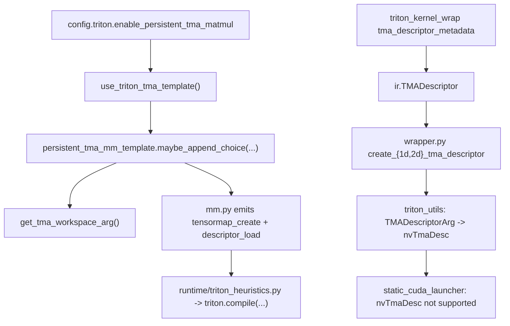

# PyTorch Inductor TMA Deep Dive

This document focuses on how TMA support is currently implemented in Inductor, what depends on Triton, and what would likely be needed for the AMD TDM analog.

## Scope and Constraints

- Source tree analyzed: `/home/niromero/pytorch`
- Runtime validation: not performed (no local NVIDIA GPU required/available)
- Method: static source analysis + upstream Triton references

## Short Answers First

1. **Is Inductor TMA support currently Gluon-based?**
   - **No** in this checkout.
   - There are no Gluon/TTGL references in `torch/_inductor` right now.
   - The implementation uses Triton APIs and template code paths directly (currently with `experimental_*` API names in this tree).

2. **If not Gluon-based, how does it work?**
   - Inductor explicitly selects TMA-capable templates, generates TMA-specific Triton source, allocates workspace for descriptors, and plumbs descriptor argument types/signatures.
   - Triton then compiles those explicit TMA operations; this is not "automatic discovery" from generic loads.

3. **For AMD, is the TMA-like feature TDM, and would Gluon help?**
   - Potentially yes, because it provides backend-oriented ops and lowering hooks.
   - TDM should not be treated as "CUDA TMA with AMD descriptors" at the Inductor level.
   - Inductor would still need backend-specific capability checks, legality rules, autotuning integration, and fallbacks.

4. **Why not only generate generic Triton and let Triton decide TMA/TDM?**
   - Inductor must decide legality and profitability, allocate extra resources, choose schedules/templates, and keep safe fallbacks.
   - Compiler lowering is only one part of the pipeline.

5. **For AMD TDM, do we need Inductor to emit `amdg.*` dialect ops directly?**
   - Usually no.
   - Inductor should emit Triton-level APIs/templates; Triton lowering should emit `amdg.*`.
   - Purely generic Triton ops can work in some cases, but TDM-specific templates are preferred for predictable legality/perf.

---

## 1) TMA in Inductor Is Not Just a Config Flag

There is a config gate:

- `torch/_inductor/config.py`:
  - `config.triton.enable_persistent_tma_matmul` (env `ENABLE_PERSISTENT_TMA_MATMUL`)

But this gate only enables selection. Real support required multiple non-config changes:

- Capability checks in `torch/utils/_triton.py`
- Compatibility filters in `torch/_inductor/utils.py`
- New template code paths in `torch/_inductor/kernel/mm.py` and `torch/_inductor/kernel/mm_scaled_grouped.py`
- Workspace descriptor plumbing via `WorkspaceArg`
- Descriptor IR and signature typing (`TMADescriptor`, `TMADescriptorArg`, `nvTmaDesc`)
- Wrapper/AOT descriptor generation paths
- Scheduler and launcher caveats

---

## 2) How Current TMA Support Works (Non-Gluon Path)

### 2.1 Capability and legality gating

`torch/utils/_triton.py` gates TMA on CUDA + architecture + API availability:

```python
if (
    torch.cuda.is_available()
    and torch.cuda.get_device_capability() >= (9, 0)
    and not torch.version.hip
):
    from triton.language.extra.cuda import (
        experimental_device_tensormap_create1d,
        experimental_device_tensormap_create2d,
    )
```

`torch/_inductor/utils.py` then enforces template-level legality:

```python
def use_triton_tma_template(*matrices: IRNode) -> bool:
    ...
    return (
        config.triton.enable_persistent_tma_matmul
        and has_triton_tma_device()
        and all(_is_tma_compatible(m) for m in matrices)
    )
```

and checks alignment/shape/type constraints (e.g., 16-byte inner alignment).

### 2.2 Template selection and workspace

In `torch/_inductor/kernel/mm.py`, Inductor appends TMA template choices only when predicate passes:

```python
if use_triton_tma_template(mat1, mat2):
    persistent_tma_mm_template.maybe_append_choice(
        choices,
        ...,
        workspace_arg=get_tma_workspace_arg(
            num_tma_descriptors=2,
            device=mat1.get_device(),
        ),
        ...
    )
```

Workspace size is explicit in `torch/_inductor/utils.py`:

```python
size = num_programs * num_tma_descriptors * TMA_DESCRIPTOR_SIZE
```

### 2.3 TMA-specific Triton code generation (device-side)

`torch/_inductor/kernel/mm.py` emits explicit TMA operations:

```python
triton.language.extra.cuda.experimental_device_tensormap_create2d(...)
tl.extra.cuda.experimental_tensormap_fenceproxy_acquire(a_desc_ptr)
a = tl._experimental_descriptor_load(...)
```

Scaled MM and grouped-MM variants use the related template paths summarized
below.

### 2.4 TMA-specific template coverage by category

In this checkout, "TMA-specific template" means one of two things:

1. A distinct template choice whose name/path is specifically TMA-oriented.
2. An existing template with an explicit `USE_TMA` branch that emits tensor
   descriptor loads.

Current coverage breaks down as follows:

1. **Plain MM / `addmm`: yes, dedicated persistent TMA template choices.**
   Relevant files:
   `torch/_inductor/kernel/templates/triton_persistent_tma_mm.py.jinja`,
   `torch/_inductor/kernel/templates/triton_blackwell_ws_persistent_device_tma_mm.py.jinja`,
   registered from `torch/_inductor/kernel/mm.py`.
2. **Scaled MM: yes, dedicated device-TMA scaled-MM template choices.**
   These cover epilogue-scaling and main-loop-scaling variants. Relevant files:
   `torch/_inductor/kernel/templates/triton_epilogue_scaled_mm.py.jinja`,
   `torch/_inductor/kernel/templates/triton_main_loop_scaled_mm.py.jinja`,
   registered from `torch/_inductor/kernel/mm.py`.
3. **Grouped / scaled grouped MM: partial / conditional.**
   The grouped template has a `USE_TMA_LOAD` path rather than a separate
   `*_tma*` file. Relevant files:
   `torch/_inductor/kernel/templates/triton_mm_grouped.py.jinja`, selected from
   `torch/_inductor/kernel/mm_grouped.py`.
4. **Flex attention / flex decoding: partial / conditional.**
   Flex templates are not separate `*_tma*` files, but they have `USE_TMA`
   branches that create `tl.make_tensor_descriptor(...)` descriptors and use
   `tl.load_tensor_descriptor(...)`. Relevant files:
   `torch/_inductor/kernel/flex/templates/flex_attention.py.jinja`,
   `torch/_inductor/kernel/flex/templates/flex_backwards.py.jinja`,
   `torch/_inductor/kernel/flex/templates/flex_decode.py.jinja`, and
   `torch/_inductor/kernel/flex/templates/common.py.jinja`.
5. **Pointwise kernels: no dedicated TMA template.**
   Generic Triton codegen can emit tensor descriptors when
   `config.triton.use_tensor_descriptor` is enabled and legality checks pass.
   Relevant files: `torch/_inductor/codegen/triton.py`, with runtime config
   filtering in `torch/_inductor/runtime/triton_heuristics.py`.
6. **Reduction kernels: no dedicated TMA template.**
   Reductions use the shared Triton codegen path; descriptor legality and
   minimum block-size constraints are reflected in `tma_min_block_sizes`.
   Relevant files: `torch/_inductor/codegen/triton.py` and
   `torch/_inductor/runtime/triton_heuristics.py`.
7. **User-defined Triton kernels: descriptor plumbing exists, but not an
   Inductor kernel template.** TMA descriptors are passed through
   `triton_kernel_wrap` metadata and wrapper generation. Relevant files:
   `torch/_higher_order_ops/triton_kernel_wrap.py`, `torch/_inductor/ir.py`,
   and `torch/_inductor/codegen/wrapper.py`.

So the important distinction is: MM-family paths have true TMA-oriented
template choices, Flex has TMA branches inside its existing templates, and
pointwise/reduction kernels rely on generic descriptor-capable Triton codegen
rather than separate TMA template files.

### 2.5 Host-side descriptor path for user-defined Triton kernels

For `triton_kernel_wrap` flows:

- metadata originates in `torch/_higher_order_ops/triton_kernel_wrap.py` via `tma_descriptor_metadata`
- lowered to `ir.UserDefinedTritonKernel(...)` in `torch/_inductor/lowering.py`
- converted to `TMADescriptor` IR in `torch/_inductor/ir.py`
- wrapper emits host descriptor calls in `torch/_inductor/codegen/wrapper.py`:

```python
prefix = "triton.tools.experimental_descriptor"
fn = f"{prefix}.create_{desc.rank}d_tma_descriptor"
```

### 2.6 Signature and launcher implications

`torch/_inductor/codegen/triton_utils.py` maps descriptor args to Triton signature type:

```python
if isinstance(arg, TMADescriptorArg):
    return "nvTmaDesc"
```

Static CUDA launcher currently does not support this:

```python
elif ty == "nvTmaDesc":
    raise NotImplementedError("nvTmaDesc kernels are not yet supported")
```

So some TMA forms are effectively JIT-path dependent.

---

## 3) What Changed for TMA Support (Concrete Checklist)

Inductor TMA support required:

- **Selection logic**
  - `use_triton_tma_template(...)` predicate for capability + legality.
- **Kernel templates**
  - new/extended templates that emit TMA-specific Triton ops.
- **Workspace management**
  - descriptor storage via `WorkspaceArg` and wrapper allocation/deallocation.
- **IR model**
  - `TMADescriptor` IR node for host-side descriptor path.
- **Argument model**
  - `TMADescriptorArg` and `nvTmaDesc` signature emission.
- **Wrapper codegen**
  - Python and C++ helper paths to materialize descriptors.
- **Runtime/scheduler behavior**
  - prologue fusion caveats for persistent+TMA templates.
- **Launcher behavior**
  - known static launcher gap for `nvTmaDesc`.

---

## 4) Triton Compiler Side: Dependencies and Expectations

### 4.1 Practical dependencies visible in PyTorch code

- CUDA device present
- Compute capability >= 9.0 (Hopper+)
- Not HIP/ROCm for current CUDA TMA path
- Triton package exposes required symbols (import-probe style checks)
- TMA legality constraints (alignment/layout/type) pass in Inductor predicates
- For C++ host-side helper code: `CUDA_VERSION >= 12000` in generated helper block

### 4.2 What Triton is expected to provide

From this checkout, Inductor expects these APIs to exist:

- `triton.language.extra.cuda.experimental_device_tensormap_create{1d,2d}`
- `tl.extra.cuda.experimental_tensormap_fenceproxy_acquire`
- `tl._experimental_descriptor_load`
- `triton.tools.experimental_descriptor.create_{1d,2d}_tma_descriptor`

If these symbols are missing, TMA paths are naturally disabled (or break where directly called).

### 4.3 API evolution risk and version pin sensitivity

Upstream Triton has changed descriptor/TMA APIs over time. In particular:

- [triton-lang/triton#6488](https://github.com/triton-lang/triton/pull/6488) removed/renamed older experimental descriptor surfaces.

This means:

- your effective PyTorch+Triton pin matters,
- API naming in the local checkout may lag or rely on compatibility behavior,
- "works on one Triton build" does not guarantee "works on another" without pin alignment.

---

## 5) FAQ (Basic Questions)

### Q: Is current Inductor TMA support Gluon-based?

**No.** In this checkout, TMA support is built around explicit Triton CUDA descriptor/tensormap APIs in Inductor templates and wrappers.

### Q: If it is not Gluon-based, how does it still work?

Inductor does four major things:

1. selects TMA templates (`use_triton_tma_template`),
2. emits TMA-specific Triton source (`experimental_device_tensormap_create2d`, descriptor loads),
3. allocates/plumbs descriptor workspace and descriptor arg types,
4. delegates lowering/codegen to Triton compiler backends.

### Q: If Gluon is used, does AMD new-arch support become easier?

Usually easier, yes. But still requires Inductor work for:

- backend feature detection,
- backend legality checks,
- template choice/autotune integration,
- scheduler/fusion constraints,
- fallback and testing behavior.

### Q: Why not only generate generic Triton and let Triton compiler figure out TMA details?

Because compiler lowering cannot replace frontend policy decisions:

- **Legality**: alignment/layout/dtype constraints must be enforced before choosing a path.
- **Profitability**: autotune/template selection happens in Inductor.
- **Resource plumbing**: workspace and descriptor args are explicit runtime artifacts.
- **Safety/fallback**: Inductor must preserve non-TMA fallbacks when constraints fail.

So the split is:

- **Inductor** decides *whether/where* to use TMA and emits the right primitives.
- **Triton** decides *how* to lower those primitives to target instructions.

### Q: For AMD TDM specifically, does Inductor need to emit AMD dialect ops directly?

Usually **no**, and with today’s architecture it should not.

- Inductor currently generates Triton kernels/source (Python-level Triton DSL), not Triton MLIR dialect IR directly.
- AMD dialect ops (for example, `amdg.async_tdm_*`) are Triton compiler internal/lowering-level representations.
- The normal integration model is:
  1. Inductor emits Triton-level operations/APIs or template metadata that express async data-movement intent.
  2. Triton lowers those to backend dialect ops (`amdg.*` for AMD).

What this means in practice:

- You generally do **not** add direct `amdg.*` dialect emission in Inductor.
- You **do** add/extend Inductor predicates + templates so generated Triton code is TDM-friendly and reliably triggers Triton’s AMD lowering path.
- Relying only on fully generic `tl.load`/`tl.store` may yield partial compiler optimizations, but it usually provides less control and weaker guarantees than explicit async/template-level intent.

### Q: Inductor supports custom Triton kernels. Does it support custom Gluon kernels?

Not as a first-class API in this checkout.

- The custom-kernel path in Inductor is Triton-specific via `triton_kernel_wrapper_*`
  in `torch/_higher_order_ops/triton_kernel_wrap.py`.
- That wrapper path expects Triton runtime kernel objects (`JITFunction`/`Autotuner`)
  and lowers through `ir.UserDefinedTritonKernel` in `torch/_inductor/lowering.py`.
- Dynamo and descriptor reconstruction hooks are also Triton-specific (e.g.
  `triton.tools.experimental_descriptor` in `torch/_dynamo/variables/*`).
- There is no parallel, first-class custom-`gluon` wrapper/operator path in
  `torch/_inductor` or `torch/_dynamo` in this tree.

Practical interpretation:

- You can provide custom Triton kernels to Inductor.
- If Triton internally lowers those kernels through Gluon/TTNG paths, that is an internal Triton backend/lowering detail, not an Inductor-level custom Gluon API.

---

## 6) AMD TDM Support from Inductor: What Would Be Needed

The current issue framing is that this is mostly a performance/integration
scoping item, not a broad functionality bring-up. Initial TDM compiler-side
work already exists; the Inductor question is how much policy, template, and
runtime plumbing is needed to make TDM reliably usable from generated kernels.

Current upstream signals suggest AMD-side TDM and async tensor-movement
building blocks exist in Triton/Gluon:

- [triton-lang/triton#7220](https://github.com/triton-lang/triton/pull/7220)
- [triton-lang/triton#7880](https://github.com/triton-lang/triton/pull/7880)
- [triton-lang/triton#8333](https://github.com/triton-lang/triton/pull/8333)

In Triton docs, AMD dialect operations include forms like:

- `amdg.async_wait`
- `amdg.async_tdm_copy_global_to_local`
- `amdg.async_tdm_wait`

Important distinction:

- Triton/Gluon can own lowering to AMD dialect ops.
- Inductor still owns when to select a TDM-friendly path, what templates enter
  autotuning, which shapes/layouts are legal, what runtime/compiler options are
  required, and what fallback path remains available.

### 6.1 Current status and non-goals

The existing evidence points to this status:

- Initial TDM enablement was done below Inductor, primarily in Triton/Gluon.
- The remaining Inductor-facing work is likely performance-oriented: selection
  policy, heuristic integration, template coverage, and removal of architecture
  assumptions that would block good MI450 behavior.
- AMD TDM is not expected to require a TMA-style tensor descriptor model in
  Inductor. Unless Triton exposes a future host descriptor API for this path,
  do not assume new `TMADescriptor`-like IR nodes, `TMADescriptorArg`-like
  arguments, `nvTmaDesc`-style signatures, or host-side descriptor wrapper
  helpers are needed.
- Removing `matrix_instr_nonkdim` is not currently a blocking TDM task. The
  local analysis found it is still wired through ROCm autotuning and compile
  metadata, and the issue notes that removal is deferred until Triton compiler
  support changes.
- Hard-coded warp/wavefront assumptions are a real cleanup item. Several
  Inductor paths still use constants such as `32` or `64` for warp-size or
  thread-count decisions; those should use device/compiler metadata where
  possible before treating new AMD architecture behavior as stable.

### 6.2 Minimum Inductor work items for AMD TDM

1. **Inventory what already happens automatically**
   - Determine which generated Triton kernels already lower to TDM on the
     target Triton/Gluon stack.
   - Separate "TDM is generated by the backend" from "Inductor intentionally
     selected a TDM-suitable schedule."

2. **Capability probes**
   - Add explicit checks in `torch/utils/_triton.py` for the AMD device,
     Triton version/API availability, and any Gluon/TDM feature probes needed
     for intentional TDM template selection.

3. **Legality predicate**
   - Add an AMD-specific predicate analogous to `use_triton_tma_template(...)`
     if Inductor selects explicit TDM-friendly templates.
   - Keep the predicate focused on observable constraints: architecture,
     dtype, alignment, strides/layout, block shape, supported pipeline shape,
     and any known TDM limits.

4. **Template additions or template annotations**
   - If generic Triton templates already lower well, Inductor may only need
     annotations/config metadata that steer autotuning.
   - If performance requires explicit async tensor movement, add AMD-specific
     template variants in MM paths such as `mm.py` and
     `mm_scaled_grouped.py`.

5. **Option/symbol plumb-through**
   - Add any required template constants, barrier semantics, wait semantics,
     wavefront-sensitive values, or argument encodings.
   - Avoid baking in warp-size constants; prefer device properties or compiler
     metadata.

6. **No descriptor plumbing expected initially**
   - Do not mirror CUDA TMA's host-side descriptor path unless the AMD/Triton
     API requires it.
   - Initial Inductor work should avoid adding `TMADescriptor` analogs,
     descriptor workspace sizing, or wrapper/C++ descriptor materialization.
   - If later Triton APIs expose a host descriptor model for AMD TDM, treat that
     as a separate integration layer rather than assuming it is part of the
     first TDM enablement.

7. **Scheduler + autotune integration**
   - Add or adjust fusion, persistent-kernel, and autotune constraints similar
     to current TMA paths.
   - Track TDM-relevant knobs in the algorithm-selection cache key only when
     they affect generated code or runtime behavior.

8. **Fallback and tests**
   - Preserve non-TDM fallback paths and add targeted correctness/perf tests.
   - Include negative tests for shapes/layouts that should not select the TDM
     path.

### 6.3 Should Inductor support AMD dialect ops directly?

Recommended approach:

- Keep Inductor at Triton API/template level.
- Do not directly model `amdg.*` dialect operations in Inductor.
- Add Triton-level TDM-oriented template code, annotations, and capability
  gates only where Inductor needs predictable selection/performance.
- Let Triton/Gluon lower those operations to AMD dialect ops.
- Do not copy CUDA TMA's tensor descriptor plumbing unless an AMD-facing Triton
  API makes descriptors part of the frontend contract.

Only consider direct dialect emission if Inductor architecture changes to
generate Triton MLIR directly, which is not the current model.

Can we just use regular Triton ops?

- Sometimes yes: backend passes may still optimize load/store patterns into
  TDM-capable code.
- If that already gives the desired performance on MI450, Inductor work may be
  limited to testing, heuristics, and cleanup of hard-coded architecture
  assumptions.
- If performance is inconsistent, explicit TDM-friendly templates and gating in
  Inductor are more reliable than hoping generic `tl.load`/`tl.store` patterns
  are recognized in all cases.

### 6.4 Illustrative pseudo-API shape (design sketch)

```python
def use_triton_amd_tdm_template(*matrices):
    from torch.utils._triton import has_triton_amd_tdm_device
    return (
        config.triton.enable_persistent_amd_tdm_matmul
        and has_triton_amd_tdm_device()
        and all(_is_amd_tdm_compatible(m) for m in matrices)
    )
```

```python
# Pseudo-template intent (names illustrative):
# - issue async tensor movement
# - insert explicit wait/barrier points
# - compute on local/shared tiles
```

### 6.5 MI450 TDM-readiness action items

If an MI450 were available today, reasonable readiness work would be:

1. **Confirm compiler stack support**
   - Build/run with the intended PyTorch + Triton/Gluon stack.
   - Verify Triton recognizes the MI450 target correctly.
   - Confirm TDM-capable lowering is enabled and not silently falling back.

2. **Create a small TDM visibility test**
   - Pick a few simple Triton kernels that should lower to TDM.
   - Dump Triton IR, AMDGPU dialect, LLVM IR, or ISA as available.
   - Check for expected `amdg.async_tdm_*`-style ops or corresponding final
     ISA patterns.

3. **Inventory Inductor-generated kernels**
   - Run representative Inductor matmul, scaled-mm, and flex-attention cases on
     MI450.
   - Save generated Triton source and compiler dumps.
   - Classify cases as already TDM-lowered, not TDM-lowered but eligible, or
     ineligible.

4. **Benchmark generic Triton first**
   - Before adding AMD-specific Inductor templates, measure whether existing
     generic Inductor Triton templates already lower well to TDM.
   - Compare against non-TDM/fallback behavior and CK or other available
     baselines where relevant.

5. **Audit hard-coded warp/wavefront assumptions**
   - Prioritize fixed `32` or `64` values in scheduling, launch sizing,
     autotune heuristics, and config generation.
   - Replace with device/compiler metadata where possible.

6. **Define legality and negative cases**
   - Identify TDM constraints for dtype, layout, alignment, block shape,
     pipeline shape, and padding.
   - Add tests proving unsupported shapes do not select a TDM-sensitive path
     incorrectly.

7. **Check autotuning behavior**
   - Verify TDM-friendly configs are present in the candidate set.
   - Ensure autotuning does not prune them because of stale CUDA/HIP
     assumptions.
   - Add TDM-relevant knobs to cache keys only when they affect generated code.

8. **Avoid descriptor plumbing for now**
   - Do not add `TMADescriptor`-style IR, wrapper, or AOT descriptor paths
     unless Triton exposes an AMD-facing frontend descriptor contract.
   - Treat TDM readiness as lowering, scheduling, and performance validation
     first.

First milestone:

- On MI450, identify at least one Inductor-generated matmul-like kernel that
  lowers to TDM, validate correctness, dump evidence from the compiler pipeline,
  and compare performance against the current fallback path.

---

## 7) Upstream Triton gfx1250 TDM Evolution (Chronological)

This section summarizes additional upstream work after initial gfx1250 TDM enablement.

### 7.1 Initial bring-up

- [#8333](https://github.com/triton-lang/triton/pull/8333): initial TDM support on gfx1250 (2D scope, descriptor-in-kernel focus).
- [#8392](https://github.com/triton-lang/triton/pull/8392): TDM store support on gfx1250.
- [#8479](https://github.com/triton-lang/triton/pull/8479): skinny block support for TDM.
- [#8510](https://github.com/triton-lang/triton/pull/8510): `ttg.async_wait` support on gfx1250 path.

### 7.2 Compiler-side descriptor and dimensionality expansion

- [#8722](https://github.com/triton-lang/triton/pull/8722): initial host-side TDM descriptor exposure in Gluon.
- [#8743](https://github.com/triton-lang/triton/pull/8743): TDM load/store support for 1D-5D.
- [#8977](https://github.com/triton-lang/triton/pull/8977): host TDM descriptor support for 1D-5D on gfx1250.
- [#9730](https://github.com/triton-lang/triton/pull/9730): col-major support for device-side TDM descriptors.

These are Triton/Gluon compiler-side milestones. They do not imply that
Inductor should mirror CUDA TMA's `TMADescriptor` IR, `nvTmaDesc` signatures, or
host-side wrapper descriptor plumbing for AMD TDM.

### 7.3 Data movement feature growth (gather/scatter/prefetch)

- [#9086](https://github.com/triton-lang/triton/pull/9086): TDM L2 prefetch support.
- [#9299](https://github.com/triton-lang/triton/pull/9299): tensor async scatter support (gfx1250/gluon).
- [#9313](https://github.com/triton-lang/triton/pull/9313): tensor async gather support using TDM.
- [#9369](https://github.com/triton-lang/triton/pull/9369): `PaddedSharedLayout` support in TDM gather.
- [#9774](https://github.com/triton-lang/triton/pull/9774) (open): predicate support in TDM gather for gfx1250.

### 7.4 Correctness and robustness fixes

- [#9371](https://github.com/triton-lang/triton/pull/9371): OOB handling fixes for TDM scatter/gather.
- [#9496](https://github.com/triton-lang/triton/pull/9496): tensordesc index fix after kernel launch changes.
- [#9720](https://github.com/triton-lang/triton/pull/9720): buffer race fix in pipelined loops with TDM loads.
- [#9725](https://github.com/triton-lang/triton/pull/9725): TDM assert typo fix.

### 7.5 Scheduling/perf heuristics and pipeline work

- [#9302](https://github.com/triton-lang/triton/pull/9302): software pipelining support with TDM on gfx1250.
- [#9741](https://github.com/triton-lang/triton/pull/9741): improved LDS padding heuristic for gfx1250 TDM dot loads.
- [#9747](https://github.com/triton-lang/triton/pull/9747): unified padded layout heuristic across async copy and TDM paths.

### 7.6 Enablement and test hardening

- [#9250](https://github.com/triton-lang/triton/pull/9250): TDM enabled by default (AMD path).
- [#9718](https://github.com/triton-lang/triton/pull/9718): tensor descriptor mode coverage added to `test_matmul.py`.
- [#8680](https://github.com/triton-lang/triton/pull/8680): gfx1250 Gluon test updates.

### 7.7 Adjacent ongoing infrastructure

- [#9717](https://github.com/triton-lang/triton/pull/9717) (open): AMD backend support for Triton-to-Gluon translator.

Interpretation:

- The trajectory is clear: initial TDM functionality was followed by compiler-side dimensionality/descriptor work, gather/scatter expansion, wait/pipeline integration, and a long tail of correctness/perf fixes.
- This reinforces that "support exists" is only phase 1; production-quality backend support needs sustained follow-up in compiler + tests + heuristics.

---

## 8) Current TMA Data Flow in Inductor



---

## 9) Practical Notes for Your Environment

- You can fully reason about architecture and codegen structure without an NVIDIA GPU.
- What you cannot validate locally is runtime performance and generated PTX/SASS behavior for TMA kernels.
- For source-level understanding and design work, this static analysis is sufficient.

---

## 10) Bottom Line

- Current Inductor TMA support is **not Gluon-based**.
- It is **not just config**; it required explicit changes across selection, templates, IR, wrappers, args/signatures, runtime plumbing, and launcher behavior.
- Relying only on generic Triton code is insufficient because Inductor must make policy and resource decisions before Triton lowering.
- For AMD, the analogous performance path is TDM, but it should not be assumed to require CUDA TMA-style tensor descriptor plumbing in Inductor.
- Inductor should generally target Triton-level APIs/templates and rely on Triton to lower into AMD dialect ops, rather than emitting AMD dialect ops directly.
