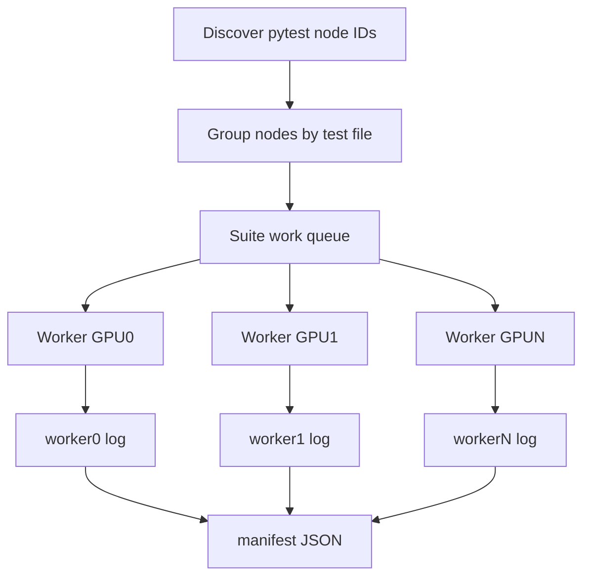

# PyTorch Unit Test Runner

`run_tests.py` runs PyTorch unit tests. It supports three run modes:

- CSV mode: run tests listed in a CSV file.
- Full-suite mode: discover tests from one or more PyTorch test files.
- Rerun-failed mode: rerun failures, and optionally timeouts, from a previous log.

Full-suite mode defaults to `test/inductor/test_torchinductor.py` and runs one pytest process per test file for lower overhead. Use `--batch-mode shard` to run fixed-size chunks, or `--batch-mode test` to use the historical one-pytest-process-per-test-node behavior.

## Requirements

- **PyTorch path**: Pass the PyTorch checkout root with `--pytorch-path`.
- The script sets `PYTORCH_TEST_WITH_ROCM=1`, `HSA_FORCE_FINE_GRAIN_PCIE=1`, and `PYTORCH_TESTING_DEVICE_ONLY_FOR=cuda` when invoking tests.
- **pytest, pytest-timeout, pytest-rerunfailures, and expecttest**: The script checks these imports and aborts with a clear message if any are missing. Install with `pip install pytest pytest-timeout pytest-rerunfailures expecttest`.
- Timeout behavior depends on execution strategy:
  - `--per-test-timeout` is passed to pytest-timeout and is a per-test timeout.
  - Full-suite `--batch-mode file` and `--batch-mode shard` also use `--per-file-timeout` as an outer safety timeout for each pytest subprocess.

## Run Modes

Use exactly one of these modes:

| Mode | How to invoke | Description |
|------|---------------|-------------|
| CSV | `csv_file` positional argument | Run pytest node IDs listed in a CSV file with a `test_name` column. |
| Full suite | `--all-tests` | Discover tests from one or more files under `PYTORCH_PATH/test/`, then run them with the selected batch mode. |
| Rerun failed | `--rerun-failed LOG_FILE` | Parse a previous log and rerun failed tests. Add `--rerun-include-timeouts` to include timed-out tests. |

Run modes and batch modes are separate concepts:

- **Run mode** chooses where the test list comes from: CSV, full-suite discovery, or a previous log.
- **Batch mode** only applies to full-suite mode. It controls how discovered pytest node IDs are grouped for execution.
- **Rerun-failed mode** is log-based. It does not use `--batch-mode file`, `--batch-mode shard`, or JUnit XML from the original run.

Examples:

```bash
# CSV mode with exact pytest node IDs
python run_tests.py my_tests.csv --pytorch-path /path/to/pytorch

# Full-suite mode with the default inductor test file
python run_tests.py --all-tests --pytorch-path /path/to/pytorch

# Full-suite mode with specific test files under PYTORCH_PATH/test/
python run_tests.py --all-tests -i test_ops.py inductor/test_config.py --pytorch-path /path/to/pytorch

# Rerun failed tests from a previous log
python run_tests.py --pytorch-path /path/to/pytorch --rerun-failed test_results_20250216_120000.log
```

## CSV Mode

- The CSV must have a column named `test_name`.
- Each `test_name` row must be a full pytest node ID, such as `test/inductor/test_flex_attention.py::TestFlexAttentionCUDA::test_block_mask_non_divisible_cuda`.
- CSV node IDs are passed directly to pytest; they are not treated as `-k` keyword expressions.
- Legacy keyword-only rows are rejected during CSV parsing with a clear error.
- Empty `test_name` rows are skipped.
- Rows whose `test_name` starts with `#` are treated as comments.
- CSV tests run in the order they appear in the file.
- CSV mode can run node IDs from any test file under the provided PyTorch checkout.

Example:

```csv
test_name
test/inductor/test_flex_attention.py::TestFlexAttentionCUDA::test_block_mask_non_divisible_cuda
test/inductor/test_aot_inductor.py::AOTInductorTestABICompatibleGpu::test_libtorch_free_so_cuda
```

## Full-Suite Mode

Full-suite mode discovers pytest node IDs with:

```bash
pytest <test_file(s)> --collect-only -q
```

The discovered node IDs are used for filtering, reporting, fallback, and resume.

If collection fails, the log includes the collect command, stdout, and stderr so import-time errors are visible.

## Full-Suite Test Selection

Full-suite mode starts from a list of files under `PYTORCH_PATH/test/`.

- **Default**: Without `-i` or a shortcut, the script uses `test/inductor/test_torchinductor.py`.
- **Explicit files**: Use `-i FILE [FILE ...]` to provide files relative to `test/`, such as `-i test_ops.py inductor/test_config.py`.
- **Inductor all shortcut**: `--include-inductor-all-tests` adds every test file under `PYTORCH_PATH/test/inductor` that is registered in PyTorch's `tools/testing/discover_tests.py`. It implies `--all-tests` and appends those files to any files passed with `-i`, de-duplicating the final list.
- **Triton nightly Inductor shortcut**: `--include-triton-nightly-inductor-tests` adds the seven files used by ROCm's `pytorch-ci-scripts/torch-triton-nightly/inductor-tests.py`:
  - `inductor/test_torchinductor.py`
  - `inductor/test_flex_attention.py`
  - `inductor/test_max_autotune.py`
  - `inductor/test_aot_inductor.py`
  - `inductor/test_flex_decoding.py`
  - `inductor/test_torchinductor_codegen_dynamic_shapes.py`
  - `inductor/test_torchinductor_opinfo.py`
- **Regex filter**: Use `--regex PATTERN` to filter discovered pytest node IDs by full test ID.

## Full-Suite Execution Strategy

Batch modes apply only to full-suite mode (`--all-tests`). CSV mode and rerun-failed mode use per-test subprocess execution.

## Retry Attempts And Failure Reporting

By default, failed test executions are retried up to two times, matching PyTorch's normal retry count. Use `--retry-attempts 0` to disable retries entirely.

Recovered tests are reported separately as flaky, while tests that still fail after all attempts are reported as consistent failures. Signal-based exits, such as `SIGKILL` or `SIGSEGV`, are categorized as failed tests and include the signal name in the per-test log and final summary.

Retry attempts and rerun-failed mode are different:

| Concept | Option | When it happens | Purpose |
|---------|--------|-----------------|---------|
| Retry attempts | `--retry-attempts N` | During the current run, immediately after a failed test attempt. | Give a failed test another chance before recording final status. |
| Rerun-failed mode | `--rerun-failed LOG_FILE` | In a later run, using a previous log. | Build a new test list from tests that failed in an earlier run. |

## Suite-Level GPU Concurrency

Use `--num-gpus N` to run full-suite test files concurrently across GPUs. This is suite/file-level concurrency: each discovered test file is assigned to one worker on one GPU, and tests from that file are not spread across multiple GPUs.

`--num-gpus > 1` is initially supported only with full-suite mode (`--all-tests`, including the full-suite shortcuts, `-i`, and `--regex`). CSV mode and rerun-failed mode reject `--num-gpus > 1`.

`--num-gpus` is orthogonal to `--batch-mode`:

- `--batch-mode file --num-gpus 4` runs up to four test files at once, each in file mode.
- `--batch-mode shard --num-gpus 4` runs up to four test files at once, each internally sharded on one GPU.
- `--batch-mode test --num-gpus 4` runs up to four test files at once, each using one-test-at-a-time execution on one GPU.



Concurrent runs avoid interleaved logs:

- The top-level `--log-file` path is the parent log.
- Worker logs are written next to it as `<log>.worker0`, `<log>.worker1`, and so on.
- The parent writes a manifest at `<log>.manifest.json`.
- Worker checkpoints are written next to worker logs.
- The parent log and manifest record full wall-clock start, end, and elapsed time for the whole concurrent run.
- Each worker log and manifest worker entry record per-worker start, end, and elapsed time.

`analyze_inductor_run.py` detects the manifest from the metadata file or parent log, parses all worker logs, deduplicates by test node ID, and reports one aggregate suite summary.

### File mode: `--batch-mode file`

File mode is the default. It runs one pytest subprocess per test file:

```bash
pytest test/inductor/test_config.py --junitxml <tempfile>
```

- Timeout is controlled by `--per-file-timeout` (default: 43200 seconds / 12 hours).
- Per-test pytest-timeout is still enabled inside the file subprocess via `--per-test-timeout` (default: 1200 seconds / 20 minutes).
- Passing files are parsed from pytest's JUnit XML output so per-test pass/skip/xfail/fail/error counts remain available.
- This is the fastest mode because PyTorch and pytest startup costs are paid once per file instead of once per pytest node.
- `test/inductor/test_torchinductor_opinfo.py` is automatically run in shard batches in file mode because one full-file pytest subprocess can be too large or crash before complete JUnit output is written.

### Shard mode: `--batch-mode shard`

Shard mode runs discovered pytest node IDs in fixed-size chunks within each file:

```bash
pytest test/inductor/test_config.py::TestA::test_1 test/inductor/test_config.py::TestA::test_2 ... --junitxml <tempfile>
```

- Shard size is controlled by `--shard-size` (default: 100 tests).
- Timeout is controlled by `--per-file-timeout` for each shard subprocess.
- Per-test pytest-timeout is still enabled inside each shard via `--per-test-timeout`.
- JUnit XML parsing, timeout recovery, `MISSED` handling, and checkpoints use the same behavior as file mode.
- Use this mode when whole-file execution records many missed tests because a large file crashes or times out before complete results are available.

### Test mode: `--batch-mode test`

Test mode preserves the historical behavior: each discovered pytest node runs in its own pytest subprocess:

```bash
pytest --timeout 300 test/inductor/test_config.py::TestInductorConfig::test_set
```

- Timeout is controlled by `--per-test-timeout` (default: 1200 seconds / 20 minutes).
- The pytest-timeout plugin enforces the test timeout.
- The script also applies an outer subprocess timeout of timeout + 60 seconds as a safety net for cases where pytest-timeout does not terminate a stuck process cleanly.

## File And Shard Fallback Behavior

`--batch-mode file` and `--batch-mode shard` are optimized for lower subprocess overhead, but they still try to keep the run moving when a test hangs.

- If a file subprocess passes, JUnit XML is parsed and each testcase is recorded as passed, skipped, failed, or error.
- If a file subprocess returns a non-zero exit code but writes JUnit XML, the script records the individual failures/errors from XML. It does not rerun failures in test mode.
- If a file subprocess exceeds `--per-file-timeout`, the script parses verbose pytest output to identify the currently running pytest node, records that node as timed out, skips it, and restarts file-mode execution for the remaining nodes in that file.
- If tests before the timed-out node cannot be recovered from JUnit XML or verbose pytest output, they are recorded as missed rather than error.
- If the timed-out node cannot be identified, the next unresolved test in that file is recorded as missed and the script continues with the following node.
- If four unidentified timeouts happen in a row in the same file, the remaining nodes in that file are recorded as missed to avoid repeatedly rerunning an unknown hang.
- Checkpoints are written after file batches and timeout recovery so interrupted runs can continue from the next discovered test.

This gives file and shard mode most of the speed benefit of batched execution while recording individual failures and skipping timed-out tests so the rest of the file can continue.

## Rerun-Failed Mode

- Input is a log file produced by a previous CSV or full-suite run.
- Rerun-failed mode is its own run mode, not a full-suite batch mode.
- By default, only tests listed in the log's `Failed tests:` summary section are rerun.
- Add `--rerun-include-timeouts` to also rerun tests listed in the `Timed out tests:` summary section.
- The script looks for:
  - `Mode: full_suite` or `Mode: csv`
  - `Failed tests:` summary section
  - `Timed out tests:` summary section
- It does not read JUnit XML. It uses only the text log passed to `--rerun-failed`.
- It always runs selected tests one at a time as full pytest node IDs.
- `--batch-mode`, `--per-file-timeout`, and `--shard-size` do not apply to rerun-failed mode.
- The current parser does not select `ERROR` or `MISSED` summary sections for rerun-failed mode.
- Rerun-failed mode creates a new log file named like `{input_stem}.rerun_{timestamp}.log`.
- If there are no tests to rerun, the script exits successfully.

## Collect-Only Mode

Use `--collect-only` with CSV mode, full-suite mode, or rerun-failed mode.

- No tests are executed.
- No log file is created.
- The script prints `Total tests: N`.
- When possible, it also prints a hierarchical count by test class.

Examples:

```bash
python run_tests.py my_tests.csv --pytorch-path /path/to/pytorch --collect-only
python run_tests.py --all-tests --pytorch-path /path/to/pytorch --collect-only
python run_tests.py --rerun-failed previous.log --pytorch-path /path/to/pytorch --collect-only
```

## Checkpointing And Resume

- By default, after each test or file batch, the script writes a checkpoint next to the log: `{log_file_path}.checkpoint`.
- The checkpoint stores the last test run, the next test to run, indices, mode, and source paths.
- Use `--resume` with the same log file path to continue from the next test.
- Resume appends to the existing log so previous results remain available for final analysis.
- If a checkpoint exists and you run without `--resume`, the script reports the checkpoint state, deletes it, and starts from the first test.
- Use `--no-checkpoint` to disable checkpoints.

## Test Outcome States

Each test is classified into exactly one state:

| State | Meaning |
|-------|---------|
| PASSED | Exit code 0 and output does not indicate a skip. |
| SKIPPED | Exit code 0 and output indicates the test was skipped. |
| XFAILED | Pytest reported an expected failure (`XFAIL`). This is tracked separately from skipped tests and is not treated as a bad outcome. |
| ERROR | Non-zero exit and `RuntimeError` appears in stdout or stderr. |
| FAILED | Non-zero exit and no `RuntimeError` appears in output. |
| TIMEDOUT | The test or fallback test hit its timeout. |
| MISSED | File mode hit an outer timeout and could not identify the currently running test, so remaining nodes in that file were not run. |

## Log File Format

- Every run logs the PyTorch path and log file path.
- CSV and full-suite runs write `Mode: csv` or `Mode: full_suite`.
- Rerun-failed logs preserve the original mode (`Mode: csv` or `Mode: full_suite`) for provenance; failed entries are rerun as full pytest node IDs.
- Each recorded test has:
  - a progress line: `[N/TOTAL]`
  - a `Running: <test_name>` header
  - test output, when available
  - a status line: `PASSED`, `SKIPPED`, `XFAILED`, `ERROR`, `FAILED`, `TIMEDOUT`, or `MISSED`
- The final summary includes total run count, pass/skip/xfail/error/fail/timeout/missed counts, total time, and per-state test lists.
- `--rerun-failed` uses the `Failed tests:` and `Timed out tests:` summary sections.
- File and shard batch modes create temporary JUnit XML files internally for per-test result attribution, but those XML files are not the public report format and are not used by rerun-failed mode.

## Analysis Script

`analyze_inductor_run.py` analyzes the runner's text log, not JUnit XML.

- It reads the log path and checkpoint path from the metadata file passed with `--meta`.
- It parses progress lines, `Running:` headers, and status lines from the log.
- It uses the checkpoint to report progress for active or resumable runs.
- It works across full-suite `file`, `shard`, and `test` batch modes because all of them write the same per-test log records, including `XFAILED`.
- It can also parse CSV and rerun-failed logs if the metadata file points at those logs.
- For completed framework runs with known metadata file sets, it may rediscover expected pytest nodes and mark unrecorded tests as `MISSED`; this rediscovery is separate from JUnit XML.

## Arguments

| Argument | Applies To | Description |
|----------|------------|-------------|
| `csv_file` | CSV mode | Path to CSV with a `test_name` column containing full pytest node IDs. Omit when using `--all-tests` or `--rerun-failed`. |
| `--all-tests` | Full-suite mode | Discover and run tests in the configured full-suite file list. |
| `--include-inductor-all-tests` | Full-suite mode | Add every registered PyTorch `test/inductor` test file from `--pytorch-path`; implies `--all-tests`. |
| `--include-triton-nightly-inductor-tests` | Full-suite mode | Add ROCm torch-triton-nightly Inductor validation files; implies `--all-tests`. |
| `--rerun-failed LOG_FILE` | Rerun-failed mode | Rerun failed tests from a previous text log. |
| `--rerun-include-timeouts` | Rerun-failed mode | Also rerun timed-out tests from the previous log. |
| `--pytorch-path PATH` | All modes | Path to the PyTorch checkout. |
| `--log-file PATH` | All modes except `--collect-only` | Path for the run log. |
| `--stop-on-failure` | All execution modes | Stop after first failing test or fallback failure. |
| `--retry-attempts N` | All execution modes | Number of times to retry a failed test before recording final failure. Default: 2; use 0 for no retries. |
| `--batch-mode {file,shard,test}` | Full-suite mode only | Full-suite execution granularity. Default: `file`. |
| `--num-gpus N` | Full-suite mode only | Run up to N test suites concurrently, one worker per GPU. Default: 1. |
| `--per-file-timeout SECONDS` | Full-suite `file`/`shard` batch modes | Outer timeout for file or shard subprocesses. Default: 43200. |
| `--shard-size N` | Full-suite `shard` mode and automatic opinfo sharding | Number of pytest node IDs per shard. Default: 100. |
| `--per-test-timeout SECONDS` | All execution modes | Pytest-timeout per-test timeout. Default: 1200. |
| `--resume` | CSV and full-suite modes | Resume from the next test after the last checkpoint. |
| `--no-checkpoint` | All execution modes | Disable checkpoint writing and resume handling. |
| `--regex PATTERN` | Full-suite mode only | Filter discovered pytest node IDs by regex. |
| `-i`, `--input-files FILE [FILE ...]` | Full-suite mode only | Add files under `PYTORCH_PATH/test/`. |
| `--collect-only` | CSV, full-suite, and rerun-failed modes | Count tests only; do not execute tests or write a log. |

## Examples

```bash
# Run a subset of tests from CSV with 120s timeout per test
python run_tests.py tests.csv --pytorch-path /path/to/pytorch --per-test-timeout 120

# Run full suite in default file mode
python run_tests.py --all-tests --pytorch-path /path/to/pytorch

# Run full suite in 100-test shards
python run_tests.py --all-tests --batch-mode shard --shard-size 100 --pytorch-path /path/to/pytorch

# Run every registered PyTorch test/inductor file with suite-level concurrency on 4 GPUs
python run_tests.py --include-inductor-all-tests --num-gpus 4 --pytorch-path /path/to/pytorch

# Run two explicit suites concurrently, with each suite internally using shard mode
python run_tests.py --all-tests -i inductor/test_aot_inductor.py inductor/test_torchinductor_opinfo.py --batch-mode shard --num-gpus 2 --pytorch-path /path/to/pytorch

# Run full suite with historical per-test-node subprocess behavior
python run_tests.py --all-tests --batch-mode test --pytorch-path /path/to/pytorch

# Run only tests whose full node id contains GPUTests
python run_tests.py --all-tests --pytorch-path /path/to/pytorch --regex GPUTests

# Run full suite from specific test files under test/
python run_tests.py --all-tests -i test_ops.py inductor/test_config.py --pytorch-path /path/to/pytorch

# Run every registered PyTorch test/inductor file
python run_tests.py --include-inductor-all-tests --pytorch-path /path/to/pytorch

# Run the ROCm torch-triton-nightly Inductor validation subset
python run_tests.py --include-triton-nightly-inductor-tests --pytorch-path /path/to/pytorch

# Run the ROCm torch-triton-nightly Inductor validation subset across 8 GPUs
python run_tests.py --include-triton-nightly-inductor-tests --num-gpus 8 --pytorch-path /path/to/pytorch

# Run without retrying failed test attempts
python run_tests.py --all-tests --retry-attempts 0 --pytorch-path /path/to/pytorch

# Resume a previous full-suite run
python run_tests.py --all-tests --pytorch-path /path/to/pytorch --log-file full_run.log --resume

# Rerun only failed tests from a previous log
python run_tests.py --pytorch-path /path/to/pytorch --rerun-failed full_run.log

# Rerun failed and timed-out tests from a previous log
python run_tests.py --pytorch-path /path/to/pytorch --rerun-failed full_run.log --rerun-include-timeouts

# Count tests only
python run_tests.py --all-tests --pytorch-path /path/to/pytorch --collect-only
python run_tests.py tests.csv --pytorch-path /path/to/pytorch --collect-only
```
